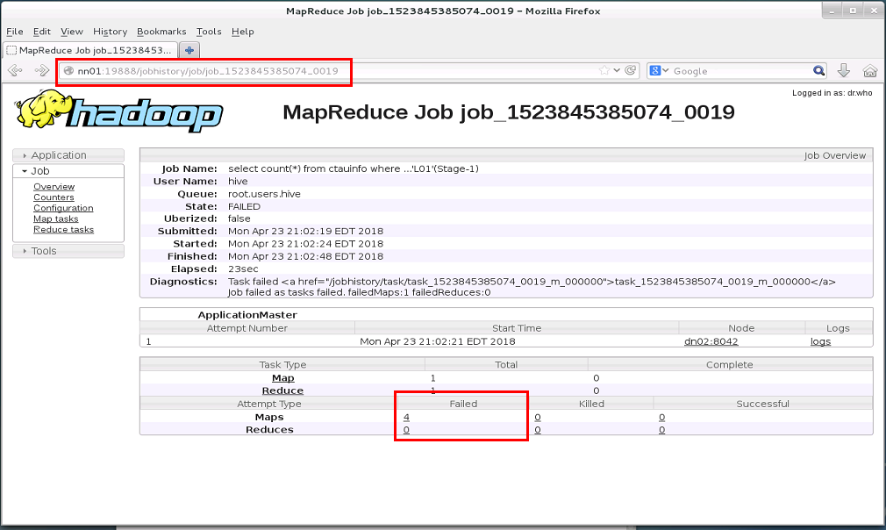
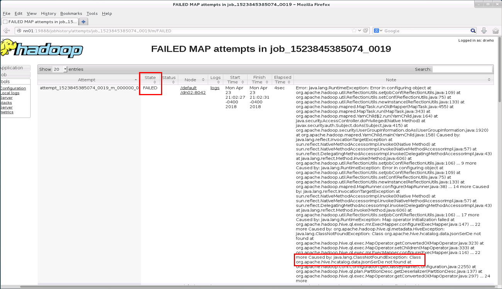

# HIVE

### HUE
HUE 인터페이스 사용

~~~
create database auctionDB;

use auctionDB;

CREATE EXTERNAL TABLE ctauInfo (
    status          STRING,
    auctionCount    STRING,
    auctionDate     STRING,
    addr            STRING,
    addr0           STRING,
    addr1           STRING,
    addr2           STRING,
    addr3           STRING,
    court           STRING,
    courtCode       STRING,
    itemNo          STRING,
    remark          STRING,
    caNo            STRING,
    pyeong          STRING,
    land1           STRING,
    land2           STRING,
    floor1          STRING,
    floor2          STRING,
    auctionInfo     STRING,
    itemType        STRING,
    appraisedValue  STRING,
    minValue        STRING,
    saleValue       STRING,
    saleRate        STRING,
    saleCount       STRING
)
ROW FORMAT SERDE 'org.apache.hive.hcatalog.data.JsonSerDe'
STORED AS TEXTFILE
location '/flume/data3';

select count(*) from ctauinfo;

~~~

### Beeline 
BeeLine 을 활용하여 CLI로 접근하는 방법
- dn01 tty 접근 가정

~~~
[eduuser@dn01 ~]$ beeline --showDbInPrompt=true
Beeline version 1.1.0-cdh5.14.2 by Apache Hive
beeline> !connect jdbc:hive2://dn02:10000
scan complete in 3ms
Connecting to jdbc:hive2://dn02:10000
Enter username for jdbc:hive2://dn02:10000: hive
Enter password for jdbc:hive2://dn02:10000: ****
Connected to: Apache Hive (version 1.1.0-cdh5.14.2)
Driver: Hive JDBC (version 1.1.0-cdh5.14.2)
Transaction isolation: TRANSACTION_REPEATABLE_READ
0: jdbc:hive2://dn02:10000> !list
1 active connection:
 #0  open     jdbc:hive2://dn02:10000
0: jdbc:hive2://dn02:10000> use auctiondb;
INFO  : Compiling command(queryId=hive_20180423195050_f8ce7a42-92bd-4a73-938a-d78e7be15ad3): use auctiondb
INFO  : Semantic Analysis Completed
INFO  : Returning Hive schema: Schema(fieldSchemas:null, properties:null)
INFO  : Completed compiling command(queryId=hive_20180423195050_f8ce7a42-92bd-4a73-938a-d78e7be15ad3); Time taken: 0.099 seconds
INFO  : Executing command(queryId=hive_20180423195050_f8ce7a42-92bd-4a73-938a-d78e7be15ad3): use auctiondb
INFO  : Starting task [Stage-0:DDL] in serial mode
INFO  : Completed executing command(queryId=hive_20180423195050_f8ce7a42-92bd-4a73-938a-d78e7be15ad3); Time taken: 0.015 seconds
INFO  : OK
No rows affected (0.218 seconds)
0: jdbc:hive2://dn02:10000> show tables;
INFO  : Compiling command(queryId=hive_20180423195050_1e5fb9e3-6a6b-42c8-9a6f-5e7671210beb): show tables
INFO  : Semantic Analysis Completed
INFO  : Returning Hive schema: Schema(fieldSchemas:[FieldSchema(name:tab_name, type:string, comment:from deserializer)], properties:null)
INFO  : Completed compiling command(queryId=hive_20180423195050_1e5fb9e3-6a6b-42c8-9a6f-5e7671210beb); Time taken: 0.005 seconds
INFO  : Executing command(queryId=hive_20180423195050_1e5fb9e3-6a6b-42c8-9a6f-5e7671210beb): show tables
INFO  : Starting task [Stage-0:DDL] in serial mode
INFO  : Completed executing command(queryId=hive_20180423195050_1e5fb9e3-6a6b-42c8-9a6f-5e7671210beb); Time taken: 0.016 seconds
INFO  : OK
+-----------+--+
| tab_name  |
+-----------+--+
| ctauinfo  |
+-----------+--+
1 row selected (0.124 seconds)
0: jdbc:hive2://dn02:10000> select * from ctauinfo limit 5;
INFO  : Compiling command(queryId=hive_20180423195050_b14f6f92-f00c-4a43-a5f0-35a04ad63251): select * from ctauinfo limit 5
INFO  : Semantic Analysis Completed
INFO  : Returning Hive schema: Schema(fieldSchemas:[FieldSchema(name:ctauinfo.status, type:string, comment:null), FieldSchema(name:ctauinfo.auctioncount, type:string, comment:null), FieldSchema(name:ctauinfo.auctiondate, type:string, comment:null), FieldSchema(name:ctauinfo.addr, type:string, comment:null), FieldSchema(name:ctauinfo.addr0, type:string, comment:null), FieldSchema(name:ctauinfo.addr1, type:string, comment:null), FieldSchema(name:ctauinfo.addr2, type:string, comment:null), FieldSchema(name:ctauinfo.addr3, type:string, comment:null), FieldSchema(name:ctauinfo.court, type:string, comment:null), FieldSchema(name:ctauinfo.courtcode, type:string, comment:null), FieldSchema(name:ctauinfo.itemno, type:string, comment:null), FieldSchema(name:ctauinfo.remark, type:string, comment:null), FieldSchema(name:ctauinfo.cano, type:string, comment:null), FieldSchema(name:ctauinfo.pyeong, type:string, comment:null), FieldSchema(name:ctauinfo.land1, type:string, comment:null), FieldSchema(name:ctauinfo.land2, type:string, comment:null), FieldSchema(name:ctauinfo.floor1, type:string, comment:null), FieldSchema(name:ctauinfo.floor2, type:string, comment:null), FieldSchema(name:ctauinfo.auctioninfo, type:string, comment:null), FieldSchema(name:ctauinfo.itemtype, type:string, comment:null), FieldSchema(name:ctauinfo.appraisedvalue, type:string, comment:null), FieldSchema(name:ctauinfo.minvalue, type:string, comment:null), FieldSchema(name:ctauinfo.salevalue, type:string, comment:null), FieldSchema(name:ctauinfo.salerate, type:string, comment:null), FieldSchema(name:ctauinfo.salecount, type:string, comment:null)], properties:null)
INFO  : Completed compiling command(queryId=hive_20180423195050_b14f6f92-f00c-4a43-a5f0-35a04ad63251); Time taken: 0.106 seconds
INFO  : Executing command(queryId=hive_20180423195050_b14f6f92-f00c-4a43-a5f0-35a04ad63251): select * from ctauinfo limit 5
INFO  : Completed executing command(queryId=hive_20180423195050_b14f6f92-f00c-4a43-a5f0-35a04ad63251); Time taken: 0.002 seconds
INFO  : OK
+------------------+------------------------+-----------------------+--------------------------------------------+-----------------+-----------------+-----------------+-----------------+-----------------+---------------------+------------------+------------------+----------------+------------------+-----------------+-----------------+------------------+------------------+----------------------------------------------+--------------------+--------------------------+--------------------+---------------------+--------------------+---------------------+--+
| ctauinfo.status  | ctauinfo.auctioncount  | ctauinfo.auctiondate  |               ctauinfo.addr                | ctauinfo.addr0  | ctauinfo.addr1  | ctauinfo.addr2  | ctauinfo.addr3  | ctauinfo.court  | ctauinfo.courtcode  | ctauinfo.itemno  | ctauinfo.remark  | ctauinfo.cano  | ctauinfo.pyeong  | ctauinfo.land1  | ctauinfo.land2  | ctauinfo.floor1  | ctauinfo.floor2  |             ctauinfo.auctioninfo             | ctauinfo.itemtype  | ctauinfo.appraisedvalue  | ctauinfo.minvalue  | ctauinfo.salevalue  | ctauinfo.salerate  | ctauinfo.salecount  |
+------------------+------------------------+-----------------------+--------------------------------------------+-----------------+-----------------+-----------------+-----------------+-----------------+---------------------+------------------+------------------+----------------+------------------+-----------------+-----------------+------------------+------------------+----------------------------------------------+--------------------+--------------------------+--------------------+---------------------+--------------------+---------------------+--+
| 배당종결             | 2                      | 2008-01-25            | 부산광역시 동래구 온천동 1444-1궁전아이브 5층 505호          | 부산광역시           | 동래구             | 온천동             |                 | 부산지방법원          | B01                 | 1                | 관련사건             | 2007타경6344     | 10.57            | 10.57           | 3.2             | 84.54            | 25.57            | 35평형,토지 10.57㎡(3.2평),건물 84.54㎡(25.57평)       | 아파트                | 176000000                |                    |                     |                    |                     |
| 배당종결             | 1                      | 2008-01-25            | 부산광역시 북구 덕천동 250-9덕천한성맨션 2동 1층 112호        | 부산광역시           | 북구              | 덕천동             |                 | 부산지방법원          | B01                 | 1                |                  | 2007타경9220     | 39.496           | 39.496          | 11.95           | 44.73            | 13.53            | 16평형,토지 39.496㎡(11.95평),건물 44.73㎡(13.53평)    | 아파트                | 44000000                 |                    | 36,399,900          | 83                 | 4                   |
| 배당종결             | 1                      | 2008-01-25            | 부산광역시 연제구 연산동 57-134연산부전타워 101동 2층 2-202호  | 부산광역시           | 연제구             | 연산동             |                 | 부산지방법원          | B01                 | 1                |                  | 2007타경15720    | 20.05            | 20.05           | 6.07            | 59.92            | 18.13            | 25평형,토지 20.05㎡(6.07평),건물 59.92㎡(18.13평)      | 아파트                | 76000000                 |                    | 65,999,000          | 87                 | 2                   |
| 배당종결             | 1                      | 2008-01-25            | 부산광역시 사하구 장림동 산21-2장림우림그린빌라 101동 9층 907호   | 부산광역시           | 사하구             | 장림동             |                 | 부산지방법원          | B01                 | 1                |                  | 2007타경20951    | 79.9827          | 79.9827         | 24.19           | 132.54           | 40.09            | 50평형,토지 79.9827㎡(24.19평),건물 132.54㎡(40.09평)  | 아파트                | 120000000                |                    | 99,100,000          | 83                 | 3                   |
| 배당종결             | 2                      | 2008-01-25            | 부산광역시 서구 암남동 81-12송도자유비치아파트 3층 307호        | 부산광역시           | 서구              | 암남동             |                 | 부산지방법원          | B01                 | 1                |                  | 2007타경23424    | 17.54            | 17.54           | 5.31            | 48.63            | 14.71            | 20평형,토지 17.54㎡(5.31평),건물 48.63㎡(14.71평)      | 아파트                | 58000000                 |                    | 42,850,000          | 74                 | 2                   |
+------------------+------------------------+-----------------------+--------------------------------------------+-----------------+-----------------+-----------------+-----------------+-----------------+---------------------+------------------+------------------+----------------+------------------+-----------------+-----------------+------------------+------------------+----------------------------------------------+--------------------+--------------------------+--------------------+---------------------+--------------------+---------------------+--+
5 rows selected (0.237 seconds)
0: jdbc:hive2://dn02:10000>
0: jdbc:hive2://dn02:10000>
0: jdbc:hive2://dn02:10000> !sh who
(unknown) :0           2018-04-14 00:37 (:0)
eduuser  pts/0        2018-04-23 19:43 (192.168.1.31)
root     pts/1        2018-04-23 19:50 (192.168.1.31)
root     pts/2        2018-04-23 19:55 (192.168.1.31)
eduuser  pts/5        2018-04-21 00:09 (dn02)
eduuser  pts/6        2018-04-21 00:17 (dn02)
esadmin  pts/7        2018-04-21 04:01 (dn02)
0: jdbc:hive2://dn02:10000>
0: jdbc:hive2://dn02:10000> select count(*) from ctauinfo where courtCode = 'L01';
INFO  : Compiling command(queryId=hive_20180423210202_4a400a72-21c5-4e33-b1e4-dbd658de60c5): select count(*) from ctauinfo where courtCode = 'L01'
INFO  : Semantic Analysis Completed
INFO  : Returning Hive schema: Schema(fieldSchemas:[FieldSchema(name:_c0, type:bigint, comment:null)], properties:null)
INFO  : Completed compiling command(queryId=hive_20180423210202_4a400a72-21c5-4e33-b1e4-dbd658de60c5); Time taken: 0.219 seconds
INFO  : Executing command(queryId=hive_20180423210202_4a400a72-21c5-4e33-b1e4-dbd658de60c5): select count(*) from ctauinfo where courtCode = 'L01'
INFO  : Query ID = hive_20180423210202_4a400a72-21c5-4e33-b1e4-dbd658de60c5
INFO  : Total jobs = 1
INFO  : Launching Job 1 out of 1
INFO  : Starting task [Stage-1:MAPRED] in serial mode
INFO  : Number of reduce tasks determined at compile time: 1
INFO  : In order to change the average load for a reducer (in bytes):
INFO  :   set hive.exec.reducers.bytes.per.reducer=<number>
INFO  : In order to limit the maximum number of reducers:
INFO  :   set hive.exec.reducers.max=<number>
INFO  : In order to set a constant number of reducers:
INFO  :   set mapreduce.job.reduces=<number>
INFO  : number of splits:1
INFO  : Submitting tokens for job: job_1523845385074_0019
INFO  : The url to track the job: http://nn01:8088/proxy/application_1523845385074_0019/
INFO  : Starting Job = job_1523845385074_0019, Tracking URL = http://nn01:8088/proxy/application_1523845385074_0019/
INFO  : Kill Command = /opt/cloudera/parcels/CDH-5.14.2-1.cdh5.14.2.p0.3/lib/hadoop/bin/hadoop job  -kill job_1523845385074_0019
INFO  : Hadoop job information for Stage-1: number of mappers: 1; number of reducers: 1
INFO  : 2018-04-23 21:02:25,203 Stage-1 map = 0%,  reduce = 0%
INFO  : 2018-04-23 21:02:48,568 Stage-1 map = 100%,  reduce = 100%
ERROR : Ended Job = job_1523845385074_0019 with errors
ERROR : FAILED: Execution Error, return code 2 from org.apache.hadoop.hive.ql.exec.mr.MapRedTask
INFO  : MapReduce Jobs Launched:
INFO  : Stage-Stage-1: Map: 1  Reduce: 1   HDFS Read: 0 HDFS Write: 0 FAIL
INFO  : Total MapReduce CPU Time Spent: 0 msec
INFO  : Completed executing command(queryId=hive_20180423210202_4a400a72-21c5-4e33-b1e4-dbd658de60c5); Time taken: 30.936 seconds
Error: Error while processing statement: FAILED: Execution Error, return code 2 from org.apache.hadoop.hive.ql.exec.mr.MapRedTask (state=08S01,code=2)
0: jdbc:hive2://dn02:10000> !sh ls /opt/cloudera/parcels/CDH/lib/hive-hcatalog/share/hcatalog/
hive-hcatalog-core-1.1.0-cdh5.14.2.jar
hive-hcatalog-core.jar
hive-hcatalog-pig-adapter-1.1.0-cdh5.14.2.jar
hive-hcatalog-pig-adapter.jar
hive-hcatalog-server-extensions-1.1.0-cdh5.14.2.jar
hive-hcatalog-server-extensions.jar
hive-hcatalog-streaming-1.1.0-cdh5.14.2.jar
hive-hcatalog-streaming.jar
0: jdbc:hive2://dn02:10000> add jar /opt/cloudera/parcels/CDH/lib/hive-hcatalog/share/hcatalog/hive-hcatalog-core.jar;
INFO  : Added [/opt/cloudera/parcels/CDH/lib/hive-hcatalog/share/hcatalog/hive-hcatalog-core.jar] to class path
INFO  : Added resources: [/opt/cloudera/parcels/CDH/lib/hive-hcatalog/share/hcatalog/hive-hcatalog-core.jar]
No rows affected (0.011 seconds)
0: jdbc:hive2://dn02:10000> select count(*) from ctauinfo where courtCode = 'L01';
INFO  : Compiling command(queryId=hive_20180423211717_21016bba-8eff-44d6-9031-d32a18aa746d): select count(*) from ctauinfo where courtCode = 'L01'
INFO  : Semantic Analysis Completed
INFO  : Returning Hive schema: Schema(fieldSchemas:[FieldSchema(name:_c0, type:bigint, comment:null)], properties:null)
INFO  : Completed compiling command(queryId=hive_20180423211717_21016bba-8eff-44d6-9031-d32a18aa746d); Time taken: 0.116 seconds
INFO  : Executing command(queryId=hive_20180423211717_21016bba-8eff-44d6-9031-d32a18aa746d): select count(*) from ctauinfo where courtCode = 'L01'
INFO  : Query ID = hive_20180423211717_21016bba-8eff-44d6-9031-d32a18aa746d
INFO  : Total jobs = 1
INFO  : Launching Job 1 out of 1
INFO  : Starting task [Stage-1:MAPRED] in serial mode
INFO  : Number of reduce tasks determined at compile time: 1
INFO  : In order to change the average load for a reducer (in bytes):
INFO  :   set hive.exec.reducers.bytes.per.reducer=<number>
INFO  : In order to limit the maximum number of reducers:
INFO  :   set hive.exec.reducers.max=<number>
INFO  : In order to set a constant number of reducers:
INFO  :   set mapreduce.job.reduces=<number>
INFO  : number of splits:1
INFO  : Submitting tokens for job: job_1523845385074_0020
INFO  : The url to track the job: http://nn01:8088/proxy/application_1523845385074_0020/
INFO  : Starting Job = job_1523845385074_0020, Tracking URL = http://nn01:8088/proxy/application_1523845385074_0020/
INFO  : Kill Command = /opt/cloudera/parcels/CDH-5.14.2-1.cdh5.14.2.p0.3/lib/hadoop/bin/hadoop job  -kill job_1523845385074_0020
INFO  : Hadoop job information for Stage-1: number of mappers: 1; number of reducers: 1
INFO  : 2018-04-23 21:17:21,659 Stage-1 map = 0%,  reduce = 0%
INFO  : 2018-04-23 21:17:32,349 Stage-1 map = 100%,  reduce = 0%, Cumulative CPU 8.06 sec
INFO  : 2018-04-23 21:17:39,863 Stage-1 map = 100%,  reduce = 100%, Cumulative CPU 11.07 sec
INFO  : MapReduce Total cumulative CPU time: 11 seconds 70 msec
INFO  : Ended Job = job_1523845385074_0020
INFO  : MapReduce Jobs Launched:
INFO  : Stage-Stage-1: Map: 1  Reduce: 1   Cumulative CPU: 11.07 sec   HDFS Read: 141858326 HDFS Write: 5 SUCCESS
INFO  : Total MapReduce CPU Time Spent: 11 seconds 70 msec
INFO  : Completed executing command(queryId=hive_20180423211717_21016bba-8eff-44d6-9031-d32a18aa746d); Time taken: 26.832 seconds
INFO  : OK
+-------+--+
|  _c0  |
+-------+--+
| 9151  |
+-------+--+
1 row selected (27.051 seconds)
0: jdbc:hive2://dn02:10000> !quit
Closing: 0: jdbc:hive2://dn02:10000
[eduuser@dn01 ~]$
~~~

### Beeline 에러발생시

1. 맵리듀스 잡 에러 발생 로그를 살펴본다
  http://nn01:8088/proxy/application_1523845385074_0019/
  
  
  json Serde 관련 class 를 찾을 수 없다는 에러

2. beeline 에서 Serde 관련 jar path 를 잡아 준다.
    ~~~
    0: jdbc:hive2://dn02:10000> add jar /opt/cloudera/parcels/CDH/lib/hive-hcatalog/share/hcatalog/hive-hcatalog-core.jar;
    ~~~

3. 다시 실행하면 정상 동작 확인된다.
