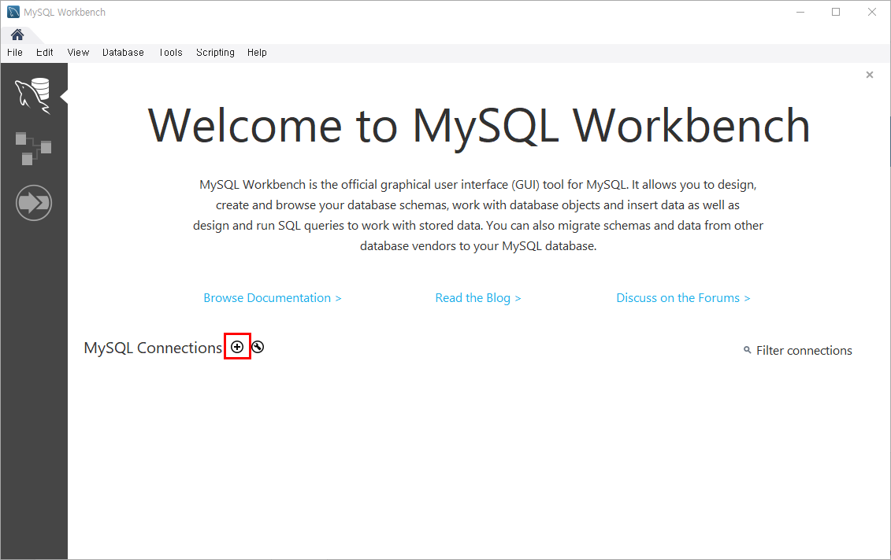
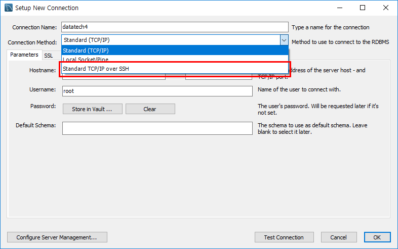
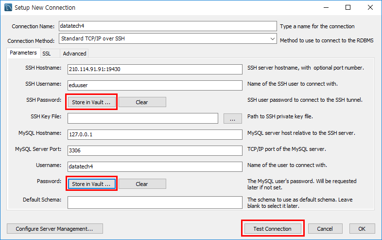
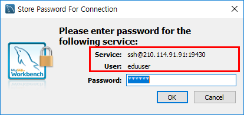
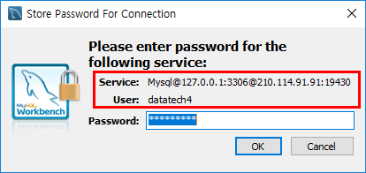
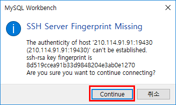
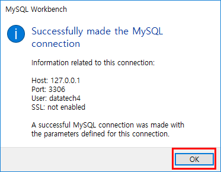
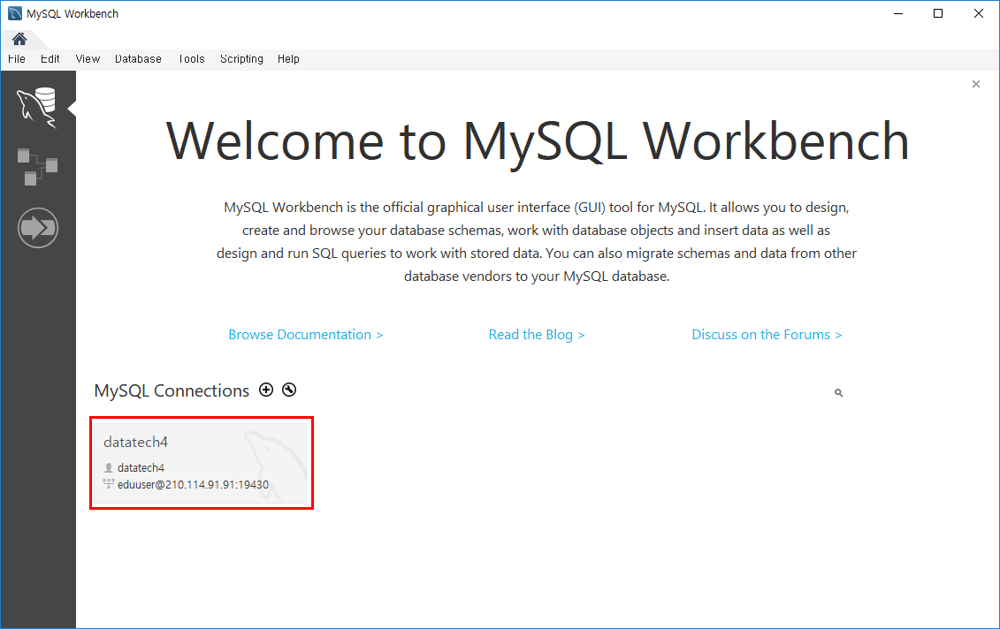
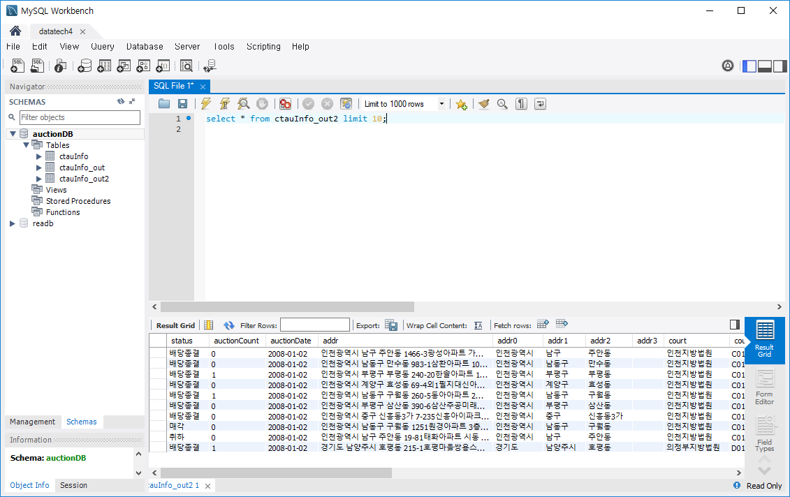

# MySQL SSH 터널링

1. MySQL Workbench 설치 후 새로운 연결을 만든다.  
  
  

2. 연결 설정에서 Connection Method 를 Standard TCP/IP over SSH 로 설정한다.
  

3. 연결 설정에서 SSH 와 MySQL 연결 정보를 설정하고 각각의 암호를 저장한다.
  
  
  

4. Test Connection 버튼을 누르고 연결 테스트를 한다.
  
  

5. 연결 테스트 정상확인 후 연결하여 데이터를 확인 한다.
  
  

