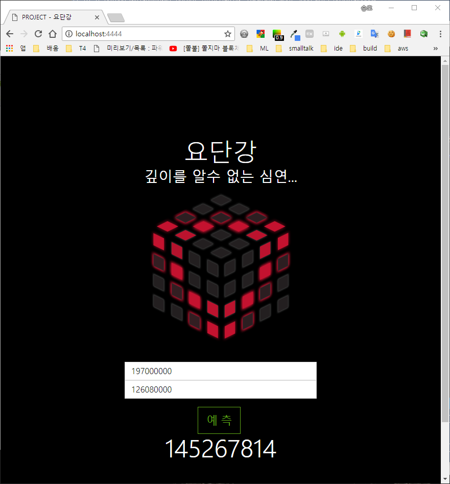
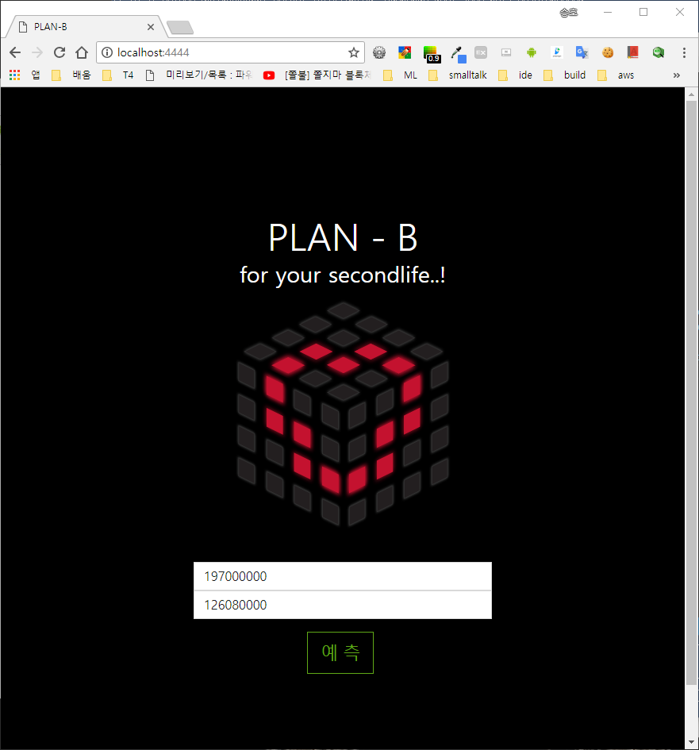
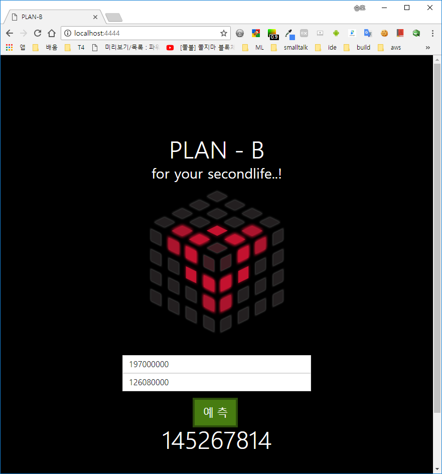

# 부동산 경매 Linear Regression 분석

### 분석 
  * Linear Regression by ur1ove
  * apply model to Flask Web service by 사발라멘

### 예측 사이트
  
  
  

### 과정
   train_model.py 로 학습후 ./data/SLR.model 로 모델 저장
   server_model.py 로 REST API 제공
   
~~~
(datatech4) D:\edu-project\datatech4\07_analysis\01>python train_model.py
   appraisedValue     minValue
0      87000000.0   87000000.0
1      65000000.0   65000000.0
2      80000000.0   56000000.0
3      62000000.0   62000000.0
4     170000000.0  119000000.0
0     99750000.0
1     82190000.0
2     78340000.0
3     69125000.0
4    162000000.0
Name: saleValue, dtype: float64
Saved model to disk

(datatech4) D:\edu-project\datatech4\07_analysis\01>python server_model.py
--------------------------------------------------------------------------------
INFO in server_model [server_model.py:53]:
* Loading starting server...
--------------------------------------------------------------------------------
 * Restarting with stat
--------------------------------------------------------------------------------
INFO in server_model [server_model.py:53]:
* Loading starting server...
--------------------------------------------------------------------------------
 * Debugger is active!
 * Debugger PIN: 127-783-246
 * Running on http://0.0.0.0:4444/ (Press CTRL+C to quit)
127.0.0.1 - - [07/May/2018 13:03:23] "GET / HTTP/1.1" 200 -
--------------------------------------------------------------------------------
DEBUG in server_model [server_model.py:31]:
{'minValue': '126080000', 'appraisedValue': '197000000'}
--------------------------------------------------------------------------------
--------------------------------------------------------------------------------
DEBUG in server_model [server_model.py:38]:
[1.45267815e+08]
--------------------------------------------------------------------------------
127.0.0.1 - - [07/May/2018 13:03:43] "POST /api/predict HTTP/1.1" 200 -
127.0.0.1 - - [07/May/2018 13:06:01] "GET / HTTP/1.1" 200 -
--------------------------------------------------------------------------------
DEBUG in server_model [server_model.py:31]:
{'minValue': '126080000', 'appraisedValue': '197000000'}
--------------------------------------------------------------------------------
--------------------------------------------------------------------------------
DEBUG in server_model [server_model.py:38]:
[1.45267815e+08]
--------------------------------------------------------------------------------
127.0.0.1 - - [07/May/2018 13:06:41] "POST /api/predict HTTP/1.1" 200 -
~~~

### conda 가상환경 설정 및 라이브러리 설치
~~~
D:\edu-project\datatech4\07_analysis\01>conda create -n datatech4 python=3.5 anaconda
Fetching package metadata .............
Solving package specifications: .

Package plan for installation in environment d:\Anaconda3\envs\datatech4:

The following NEW packages will be INSTALLED:

    alabaster:                          0.7.10-py35h3a808de_0
    anaconda:                           5.1.0-py35_2
    anaconda-client:                    1.6.9-py35_0
    anaconda-project:                   0.8.2-py35h06aeb26_0
    asn1crypto:                         0.24.0-py35_0
    astroid:                            1.6.1-py35_0
    astropy:                            2.0.3-py35hfa6e2cd_0
    attrs:                              17.4.0-py35_0
    babel:                              2.5.3-py35_0
    backports:                          1.0-py35he88aa47_1
    backports.shutil_get_terminal_size: 1.0.0-py35h9d89c8b_2
    beautifulsoup4:                     4.6.0-py35h61fcdcc_1
    bitarray:                           0.8.1-py35hfa6e2cd_1
    bkcharts:                           0.2-py35h4704c85_0
    blaze:                              0.11.3-py35hae12140_0
    bleach:                             2.1.2-py35_0
    bokeh:                              0.12.13-py35h047fa9f_0
    boto:                               2.48.0-py35ha0bef00_1
    bottleneck:                         1.2.1-py35h8a3671c_0
    bzip2:                              1.0.6-hbe05fcf_4
    ca-certificates:                    2017.08.26-h94faf87_0
    certifi:                            2018.1.18-py35_0
    cffi:                               1.11.4-py35hfa6e2cd_0
    chardet:                            3.0.4-py35h177e1b7_1
    click:                              6.7-py35h10df73f_0
    cloudpickle:                        0.5.2-py35_1
    clyent:                             1.2.2-py35h3cd9751_1
    colorama:                           0.3.9-py35h32a752f_0
    comtypes:                           1.1.4-py35_0
    console_shortcut:                   0.1.1-h6bb2dd7_3
    contextlib2:                        0.5.5-py35h0a97e54_0
    cryptography:                       2.1.4-py35h8ead9e0_0
    curl:                               7.58.0-h7602738_0
    cycler:                             0.10.0-py35hcc71164_0
    cython:                             0.27.3-py35h82876f0_0
    cytoolz:                            0.9.0-py35hfa6e2cd_0
    dask:                               0.16.1-py35_0
    dask-core:                          0.16.1-py35_0
    datashape:                          0.5.4-py35ha38994c_0
    decorator:                          4.2.1-py35_0
    distributed:                        1.20.2-py35_0
    docutils:                           0.14-py35h8ccb97f_0
    entrypoints:                        0.2.3-py35hb91ced9_2
    et_xmlfile:                         1.0.1-py35h2c13def_0
    fastcache:                          1.0.2-py35hfa6e2cd_2
    filelock:                           2.0.13-py35hed8fc95_0
    flask:                              0.12.2-py35he898f9a_0
    flask-cors:                         3.0.3-py35h5700fb0_0
    freetype:                           2.8-h51f8f2c_1
    get_terminal_size:                  1.0.0-h38e98db_0
    gevent:                             1.2.2-py35hb3d9581_0
    glob2:                              0.6-py35h9eb15d0_0
    greenlet:                           0.4.12-py35h0b77e5a_0
    h5py:                               2.7.1-py35hb2c3add_0
    hdf5:                               1.10.1-h98b8871_1
    heapdict:                           1.0.0-py35_2
    html5lib:                           1.0.1-py35h047fa9f_0
    icc_rt:                             2017.0.4-h97af966_0
    icu:                                58.2-ha66f8fd_1
    idna:                               2.6-py35h8dcb9ae_1
    imageio:                            2.2.0-py35hcd4b9a4_0
    imagesize:                          0.7.1-py35h7f87e83_0
    intel-openmp:                       2018.0.0-hd92c6cd_8
    ipykernel:                          4.8.0-py35_0
    ipython:                            6.2.1-py35h4a2ac14_1
    ipython_genutils:                   0.2.0-py35ha709e79_0
    ipywidgets:                         7.1.1-py35_0
    isort:                              4.2.15-py35h0bf7b49_0
    itsdangerous:                       0.24-py35h99d45d4_1
    jdcal:                              1.3-py35h49a1460_0
    jedi:                               0.11.1-py35_0
    jinja2:                             2.10-py35hdf652bb_0
    jpeg:                               9b-hb83a4c4_2
    jsonschema:                         2.6.0-py35h27d56d3_0
    jupyter:                            1.0.0-py35_4
    jupyter_client:                     5.2.2-py35_0
    jupyter_console:                    5.2.0-py35hf76c22e_1
    jupyter_core:                       4.4.0-py35h629ba7f_0
    jupyterlab:                         0.31.4-py35_0
    jupyterlab_launcher:                0.10.2-py35_0
    lazy-object-proxy:                  1.3.1-py35he996729_0
    libcurl:                            7.58.0-h7602738_0
    libiconv:                           1.15-h1df5818_7
    libpng:                             1.6.34-h79bbb47_0
    libssh2:                            1.8.0-hd619d38_4
    libtiff:                            4.0.9-h0f13578_0
    libxml2:                            2.9.7-h79bbb47_0
    libxslt:                            1.1.32-hf6f1972_0
    llvmlite:                           0.21.0-py35h255174b_0
    locket:                             0.2.0-py35h0dfcdd0_1
    lxml:                               4.1.1-py35hef2cd61_1
    lzo:                                2.10-h6df0209_2
    markupsafe:                         1.0-py35hc253e08_1
    matplotlib:                         2.1.2-py35h016c42a_0
    mccabe:                             0.6.1-py35hcf31250_1
    menuinst:                           1.4.11-py35hfa6e2cd_0
    mistune:                            0.8.3-py35_0
    mkl:                                2018.0.1-h2108138_4
    mkl-service:                        1.1.2-py35h051acba_4
    mpmath:                             1.0.0-py35h253b693_2
    msgpack-python:                     0.5.1-py35he980bc4_0
    multipledispatch:                   0.4.9-py35hfb38682_0
    nbconvert:                          5.3.1-py35h98d6c46_0
    nbformat:                           4.4.0-py35h908c9d9_0
    networkx:                           2.1-py35_0
    nltk:                               3.2.5-py35hbbcff45_0
    nose:                               1.3.7-py35h0e9586c_2
    notebook:                           5.4.0-py35_0
    numba:                              0.36.2-np114py35h76ba9cb_0
    numexpr:                            2.6.4-py35hb78e28a_0
    numpy:                              1.14.0-py35h4a99626_1
    numpydoc:                           0.7.0-py35h72ac4f2_0
    odo:                                0.5.1-py35hc850252_0
    olefile:                            0.45.1-py35_0
    openpyxl:                           2.4.10-py35_0
    openssl:                            1.0.2n-h74b6da3_0
    packaging:                          16.8-py35h5fb721f_1
    pandas:                             0.22.0-py35h6538335_0
    pandoc:                             1.19.2.1-hb2460c7_1
    pandocfilters:                      1.4.2-py35h978f723_1
    parso:                              0.1.1-py35he39c48a_0
    partd:                              0.3.8-py35h894d1e4_0
    path.py:                            10.5-py35h3b5be1d_0
    pathlib2:                           2.3.0-py35h4f1e8f6_0
    patsy:                              0.5.0-py35_0
    pep8:                               1.7.1-py35_0
    pickleshare:                        0.7.4-py35h2f9f535_0
    pillow:                             5.0.0-py35h0738816_0
    pip:                                9.0.1-py35h691316f_4
    pkginfo:                            1.4.1-py35hb922f74_1
    pluggy:                             0.6.0-py35h717ee57_0
    ply:                                3.10-py35hb60f152_0
    prompt_toolkit:                     1.0.15-py35h89c7cb4_0
    psutil:                             5.4.3-py35hfa6e2cd_0
    py:                                 1.5.2-py35h4fcc378_0
    pycodestyle:                        2.3.1-py35h35694a3_0
    pycosat:                            0.6.3-py35h456c199_0
    pycparser:                          2.18-py35h15a15da_1
    pycrypto:                           2.6.1-py35hfa6e2cd_7
    pycurl:                             7.43.0.1-py35h74b6da3_0
    pyflakes:                           1.6.0-py35hb7fdafe_0
    pygments:                           2.2.0-py35h24c0941_0
    pylint:                             1.8.2-py35_0
    pyodbc:                             4.0.22-py35h6538335_0
    pyopenssl:                          17.5.0-py35h75c5b16_0
    pyparsing:                          2.2.0-py35hcabcaab_1
    pyqt:                               5.6.0-py35hd46907b_5
    pysocks:                            1.6.7-py35hb30ac0d_1
    pytables:                           3.4.2-py35h9e98cc6_2
    pytest:                             3.3.2-py35_0
    python:                             3.5.4-h1357f44_23
    python-dateutil:                    2.6.1-py35h6b299a3_1
    pytz:                               2017.3-py35hb294b1a_0
    pywavelets:                         0.5.2-py35h7c47ace_0
    pywin32:                            222-py35hfa6e2cd_0
    pywinpty:                           0.5-py35h6538335_1
    pyyaml:                             3.12-py35h4bf9689_1
    pyzmq:                              16.0.3-py35h1861011_0
    qt:                                 5.6.2-vc14h6f8c307_12
    qtawesome:                          0.4.4-py35h639d0ff_0
    qtconsole:                          4.3.1-py35hc47b0dd_0
    qtpy:                               1.3.1-py35h4918c39_0
    requests:                           2.18.4-py35h54a615f_1
    rope:                               0.10.7-py35h5756fe0_0
    ruamel_yaml:                        0.15.35-py35hfa6e2cd_1
    scikit-image:                       0.13.1-py35hfa6e2cd_1
    scikit-learn:                       0.19.1-py35h2037775_0
    scipy:                              1.0.0-py35h75710e8_0
    seaborn:                            0.8.1-py35hc73483e_0
    send2trash:                         1.4.2-py35_0
    setuptools:                         38.4.0-py35_0
    simplegeneric:                      0.8.1-py35_2
    singledispatch:                     3.4.0.3-py35h33f66b4_0
    sip:                                4.18.1-py35h01cbaa7_2
    six:                                1.11.0-py35hc1da2df_1
    snowballstemmer:                    1.2.1-py35h4c55bfa_0
    sortedcollections:                  0.5.3-py35h4a7ff62_0
    sortedcontainers:                   1.5.9-py35_0
    sphinx:                             1.6.6-py35_0
    sphinxcontrib:                      1.0-py35h45f5ca3_1
    sphinxcontrib-websupport:           1.0.1-py35ha3690eb_1
    spyder:                             3.2.6-py35_0
    sqlalchemy:                         1.2.1-py35hfa6e2cd_0
    sqlite:                             3.22.0-h9d3ae62_0
    statsmodels:                        0.8.0-py35hfa6034c_0
    sympy:                              1.1.1-py35ha5375ed_0
    tblib:                              1.3.2-py35hd2cf7e1_0
    terminado:                          0.8.1-py35_1
    testpath:                           0.3.1-py35h06cf69e_0
    tk:                                 8.6.7-hcb92d03_3
    toolz:                              0.9.0-py35_0
    tornado:                            4.5.3-py35_0
    traitlets:                          4.3.2-py35h09b975b_0
    typing:                             3.6.2-py35h37628ea_0
    unicodecsv:                         0.14.1-py35h0d88516_0
    urllib3:                            1.22-py35h8cc84eb_0
    vc:                                 14-h0510ff6_3
    vs2015_runtime:                     14.0.25123-3
    wcwidth:                            0.1.7-py35h6e80d8a_0
    webencodings:                       0.5.1-py35h5d527fb_1
    werkzeug:                           0.14.1-py35_0
    wheel:                              0.30.0-py35h38a90bc_1
    widgetsnbextension:                 3.1.0-py35_0
    win_inet_pton:                      1.0.1-py35hbef1270_1
    win_unicode_console:                0.5-py35h56988b5_0
    wincertstore:                       0.2-py35hfebbdb8_0
    winpty:                             0.4.3-4
    wrapt:                              1.10.11-py35h54666f7_0
    xlrd:                               1.1.0-py35h22b952b_1
    xlsxwriter:                         1.0.2-py35h6052a16_0
    xlwings:                            0.11.5-py35_0
    xlwt:                               1.3.0-py35hd04410a_0
    yaml:                               0.1.7-hc54c509_2
    zict:                               0.1.3-py35hf5542e0_0
    zlib:                               1.2.11-h8395fce_2

Proceed ([y]/n)? n

Exiting

D:\edu-project\datatech4\07_analysis\01>conda create -n datatech4 python=3.5
Fetching package metadata .............
Solving package specifications: .

Package plan for installation in environment d:\Anaconda3\envs\datatech4:

The following NEW packages will be INSTALLED:

    certifi:        2018.4.16-py35_0
    pip:            10.0.1-py35_0
    python:         3.5.5-h0c2934d_2
    setuptools:     39.1.0-py35_0
    vc:             14-h0510ff6_3
    vs2015_runtime: 14.0.25123-3
    wheel:          0.31.0-py35_0
    wincertstore:   0.2-py35hfebbdb8_0

Proceed ([y]/n)? y

python-3.5.5-h 100% |###############################| Time: 0:00:00  19.41 MB/s
certifi-2018.4 100% |###############################| Time: 0:00:00   9.75 MB/s
wincertstore-0 100% |###############################| Time: 0:00:00   2.81 MB/s
setuptools-39. 100% |###############################| Time: 0:00:00  20.91 MB/s
wheel-0.31.0-p 100% |###############################| Time: 0:00:00   7.51 MB/s
pip-10.0.1-py3 100% |###############################| Time: 0:00:00  20.65 MB/s
#
# To activate this environment, use:
# > activate datatech4
#
# To deactivate an active environment, use:
# > deactivate
#
# * for power-users using bash, you must source
#

D:\edu-project\datatech4\07_analysis\01>activate datatech4

(datatech4) D:\edu-project\datatech4\07_analysis\01>conda install ipython notebook
Fetching package metadata .............
Solving package specifications: .

Package plan for installation in environment d:\Anaconda3\envs\datatech4:

The following NEW packages will be INSTALLED:

    backcall:                0.1.0-py35_0
    bleach:                  2.1.3-py35_0
    colorama:                0.3.9-py35h32a752f_0
    decorator:               4.3.0-py35_0
    entrypoints:             0.2.3-py35hb91ced9_2
    html5lib:                1.0.1-py35h047fa9f_0
    ipykernel:               4.8.2-py35_0
    ipython:                 6.3.1-py35_0
    ipython_genutils:        0.2.0-py35ha709e79_0
    jedi:                    0.12.0-py35_1
    jinja2:                  2.10-py35hdf652bb_0
    jsonschema:              2.6.0-py35h27d56d3_0
    jupyter_client:          5.2.3-py35_0
    jupyter_core:            4.4.0-py35h629ba7f_0
    libsodium:               1.0.16-h9d3ae62_0
    m2w64-gcc-libgfortran:   5.3.0-6
    m2w64-gcc-libs:          5.3.0-7
    m2w64-gcc-libs-core:     5.3.0-7
    m2w64-gmp:               6.1.0-2
    m2w64-libwinpthread-git: 5.0.0.4634.697f757-2
    markupsafe:              1.0-py35hc253e08_1
    mistune:                 0.8.3-py35hfa6e2cd_1
    msys2-conda-epoch:       20160418-1
    nbconvert:               5.3.1-py35h98d6c46_0
    nbformat:                4.4.0-py35h908c9d9_0
    notebook:                5.4.1-py35_0
    pandoc:                  1.19.2.1-hb2460c7_1
    pandocfilters:           1.4.2-py35h978f723_1
    parso:                   0.2.0-py35_0
    pickleshare:             0.7.4-py35h2f9f535_0
    prompt_toolkit:          1.0.15-py35h89c7cb4_0
    pygments:                2.2.0-py35h24c0941_0
    python-dateutil:         2.7.2-py35_0
    pywinpty:                0.5.1-py35_0
    pyzmq:                   17.0.0-py35hfa6e2cd_1
    send2trash:              1.5.0-py35_0
    simplegeneric:           0.8.1-py35_2
    six:                     1.11.0-py35hc1da2df_1
    terminado:               0.8.1-py35_1
    testpath:                0.3.1-py35h06cf69e_0
    tornado:                 5.0.2-py35_0
    traitlets:               4.3.2-py35h09b975b_0
    wcwidth:                 0.1.7-py35h6e80d8a_0
    webencodings:            0.5.1-py35h5d527fb_1
    win_unicode_console:     0.5-py35h56988b5_0
    winpty:                  0.4.3-4
    zeromq:                  4.2.5-hc6251cf_0

Proceed ([y]/n)? y

backcall-0.1.0 100% |###############################| Time: 0:00:00 852.11 kB/s
colorama-0.3.9 100% |###############################| Time: 0:00:00   4.74 MB/s
decorator-4.3. 100% |###############################| Time: 0:00:00   1.64 MB/s
entrypoints-0. 100% |###############################| Time: 0:00:00 917.54 kB/s
ipython_genuti 100% |###############################| Time: 0:00:00   2.82 MB/s
markupsafe-1.0 100% |###############################| Time: 0:00:00   1.76 MB/s
mistune-0.8.3- 100% |###############################| Time: 0:00:00   3.41 MB/s
pandocfilters- 100% |###############################| Time: 0:00:00   2.13 MB/s
parso-0.2.0-py 100% |###############################| Time: 0:00:00   8.59 MB/s
pickleshare-0. 100% |###############################| Time: 0:00:00   2.36 MB/s
send2trash-1.5 100% |###############################| Time: 0:00:00   2.76 MB/s
simplegeneric- 100% |###############################| Time: 0:00:00   1.99 MB/s
six-1.11.0-py3 100% |###############################| Time: 0:00:00   4.36 MB/s
testpath-0.3.1 100% |###############################| Time: 0:00:00   6.53 MB/s
tornado-5.0.2- 100% |###############################| Time: 0:00:00   6.64 MB/s
wcwidth-0.1.7- 100% |###############################| Time: 0:00:00   4.24 MB/s
webencodings-0 100% |###############################| Time: 0:00:00   2.49 MB/s
win_unicode_co 100% |###############################| Time: 0:00:00   5.37 MB/s
html5lib-1.0.1 100% |###############################| Time: 0:00:00  10.74 MB/s
jedi-0.12.0-py 100% |###############################| Time: 0:00:00  10.06 MB/s
python-dateuti 100% |###############################| Time: 0:00:00  11.93 MB/s
pyzmq-17.0.0-p 100% |###############################| Time: 0:00:00  16.29 MB/s
traitlets-4.3. 100% |###############################| Time: 0:00:00   7.92 MB/s
bleach-2.1.3-p 100% |###############################| Time: 0:00:00   4.86 MB/s
jinja2-2.10-py 100% |###############################| Time: 0:00:00  12.36 MB/s
jsonschema-2.6 100% |###############################| Time: 0:00:00  11.89 MB/s
jupyter_core-4 100% |###############################| Time: 0:00:00  10.73 MB/s
pygments-2.2.0 100% |###############################| Time: 0:00:00  17.70 MB/s
pywinpty-0.5.1 100% |###############################| Time: 0:00:00   5.54 MB/s
jupyter_client 100% |###############################| Time: 0:00:00  14.83 MB/s
nbformat-4.4.0 100% |###############################| Time: 0:00:00  13.38 MB/s
prompt_toolkit 100% |###############################| Time: 0:00:00  15.21 MB/s
terminado-0.8. 100% |###############################| Time: 0:00:00   3.08 MB/s
ipython-6.3.1- 100% |###############################| Time: 0:00:00  17.04 MB/s
nbconvert-5.3. 100% |###############################| Time: 0:00:00  15.24 MB/s
ipykernel-4.8. 100% |###############################| Time: 0:00:00  12.51 MB/s
notebook-5.4.1 100% |###############################| Time: 0:00:00  18.37 MB/s
DEBUG menuinst_win32:__init__(185): Menu: name: 'Anaconda${PY_VER} ${PLATFORM}', prefix: 'd:\Anaconda3\envs\datatech4', env_name: 'datatech4', mode: 'None', used_mode: 'system'

(datatech4) D:\edu-project\datatech4\07_analysis\01>conda install numpy matplotlib pandas pydotplus h5py scikit-learn
Fetching package metadata .............
Solving package specifications: .

Package plan for installation in environment d:\Anaconda3\envs\datatech4:

The following NEW packages will be INSTALLED:

    ca-certificates: 2018.03.07-0
    cycler:          0.10.0-py35hcc71164_0
    freetype:        2.8-h51f8f2c_1
    h5py:            2.7.1-py35hd8ea038_0
    hdf5:            1.8.18-hcf527f2_1
    icc_rt:          2017.0.4-h97af966_0
    icu:             58.2-ha66f8fd_1
    intel-openmp:    2018.0.0-8
    jpeg:            9b-hb83a4c4_2
    kiwisolver:      1.0.1-py35hc605aed_0
    libpng:          1.6.34-h79bbb47_0
    matplotlib:      2.2.2-py35h153e9ff_1
    mkl:             2018.0.2-1
    mkl_fft:         1.0.1-py35h452e1ab_0
    mkl_random:      1.0.1-py35h9258bd6_0
    numpy:           1.14.2-py35h5c71026_1
    openssl:         1.0.2o-h8ea7d77_0
    pandas:          0.22.0-py35h6538335_0
    pydotplus:       2.0.2-py35_0
    pyparsing:       2.2.0-py35hcabcaab_1
    pyqt:            5.9.2-py35h1aa27d4_0
    pytz:            2018.4-py35_0
    qt:              5.9.5-vc14he4a7d60_0
    scikit-learn:    0.19.1-py35h2037775_0
    scipy:           1.0.1-py35hce232c7_0
    sip:             4.19.8-py35h6538335_0
    sqlite:          3.23.1-h35aae40_0
    zlib:            1.2.11-h8395fce_2

Proceed ([y]/n)? y

intel-openmp-2 100% |###############################| Time: 0:00:00  11.24 MB/s
mkl-2018.0.2-1 100% |###############################| Time: 0:00:07  24.34 MB/s
sqlite-3.23.1- 100% |###############################| Time: 0:00:00  27.74 MB/s
hdf5-1.8.18-hc 100% |###############################| Time: 0:00:01  26.70 MB/s
kiwisolver-1.0 100% |###############################| Time: 0:00:00  10.41 MB/s
pyparsing-2.2. 100% |###############################| Time: 0:00:00   8.17 MB/s
pytz-2018.4-py 100% |###############################| Time: 0:00:00  14.55 MB/s
sip-4.19.8-py3 100% |###############################| Time: 0:00:00  22.20 MB/s
cycler-0.10.0- 100% |###############################| Time: 0:00:00   2.74 MB/s
pydotplus-2.0. 100% |###############################| Time: 0:00:00   6.36 MB/s
qt-5.9.5-vc14h 100% |###############################| Time: 0:00:04  26.64 MB/s
pyqt-5.9.2-py3 100% |###############################| Time: 0:00:00  27.57 MB/s
h5py-2.7.1-py3 100% |###############################| Time: 0:00:00  24.66 MB/s
matplotlib-2.2 100% |###############################| Time: 0:00:00  26.86 MB/s
mkl_fft-1.0.1- 100% |###############################| Time: 0:00:00  12.66 MB/s
mkl_random-1.0 100% |###############################| Time: 0:00:00  22.00 MB/s
numpy-1.14.2-p 100% |###############################| Time: 0:00:00  27.24 MB/s
pandas-0.22.0- 100% |###############################| Time: 0:00:00  26.51 MB/s
scipy-1.0.1-py 100% |###############################| Time: 0:00:00  25.31 MB/s
scikit-learn-0 100% |###############################| Time: 0:00:00  25.00 MB/s

((datatech4) D:\edu-project\datatech4\07_analysis\01>conda install scipy mkl-service libpython m2w64-toolchain
Fetching package metadata .............
Solving package specifications: .

Package plan for installation in environment d:\Anaconda3\envs\datatech4:

The following NEW packages will be INSTALLED:

    libpython:                      2.1-py35_0
    m2w64-binutils:                 2.25.1-5
    m2w64-bzip2:                    1.0.6-6
    m2w64-crt-git:                  5.0.0.4636.2595836-2
    m2w64-gcc:                      5.3.0-6
    m2w64-gcc-ada:                  5.3.0-6
    m2w64-gcc-fortran:              5.3.0-6
    m2w64-gcc-objc:                 5.3.0-6
    m2w64-headers-git:              5.0.0.4636.c0ad18a-2
    m2w64-isl:                      0.16.1-2
    m2w64-libiconv:                 1.14-6
    m2w64-libmangle-git:            5.0.0.4509.2e5a9a2-2
    m2w64-make:                     4.1.2351.a80a8b8-2
    m2w64-mpc:                      1.0.3-3
    m2w64-mpfr:                     3.1.4-4
    m2w64-pkg-config:               0.29.1-2
    m2w64-toolchain:                5.3.0-7
    m2w64-tools-git:                5.0.0.4592.90b8472-2
    m2w64-windows-default-manifest: 6.4-3
    m2w64-winpthreads-git:          5.0.0.4634.697f757-2
    m2w64-zlib:                     1.2.8-10
    mkl-service:                    1.1.2-py35h051acba_4

Proceed ([y]/n)? y

m2w64-headers- 100% |###############################| Time: 0:00:00  13.45 MB/s
m2w64-isl-0.16 100% |###############################| Time: 0:00:00  13.66 MB/s
m2w64-libiconv 100% |###############################| Time: 0:00:00  17.24 MB/s
m2w64-libmangl 100% |###############################| Time: 0:00:00 998.87 kB/s
m2w64-make-4.1 100% |###############################| Time: 0:00:00   4.21 MB/s
m2w64-windows- 100% |###############################| Time: 0:00:00 691.89 kB/s
m2w64-crt-git- 100% |###############################| Time: 0:00:00  10.64 MB/s
m2w64-mpfr-3.1 100% |###############################| Time: 0:00:00  11.10 MB/s
m2w64-pkg-conf 100% |###############################| Time: 0:00:00  12.63 MB/s
libpython-2.1- 100% |###############################| Time: 0:00:01  22.26 MB/s
m2w64-mpc-1.0. 100% |###############################| Time: 0:00:00   4.47 MB/s
m2w64-winpthre 100% |###############################| Time: 0:00:00   3.08 MB/s
mkl-service-1. 100% |###############################| Time: 0:00:00   1.46 MB/s
m2w64-bzip2-1. 100% |###############################| Time: 0:00:00   5.68 MB/s
m2w64-tools-gi 100% |###############################| Time: 0:00:00   7.64 MB/s
m2w64-zlib-1.2 100% |###############################| Time: 0:00:00  15.49 MB/s
m2w64-binutils 100% |###############################| Time: 0:00:02  21.31 MB/s
m2w64-gcc-5.3. 100% |###############################| Time: 0:00:01  23.64 MB/s
m2w64-gcc-ada- 100% |###############################| Time: 0:00:01  27.06 MB/s
m2w64-gcc-fort 100% |###############################| Time: 0:00:00  27.51 MB/s
m2w64-gcc-objc 100% |###############################| Time: 0:00:00  26.18 MB/s
m2w64-toolchai 100% |###############################| Time: 0:00:00 456.86 kB/s

(datatech4) D:\edu-project\datatech4\07_analysis\01>conda install pygpu graphviz tensorflow
Fetching package metadata .............
Solving package specifications: .

Package plan for installation in environment d:\Anaconda3\envs\datatech4:

The following NEW packages will be INSTALLED:

    absl-py:         0.2.0-py35_0
    astor:           0.6.2-py35_0
    gast:            0.2.0-py35_0
    graphviz:        2.38.0-4
    grpcio:          1.11.0-py35he025d50_0
    libgpuarray:     0.7.5-hfa6e2cd_0
    libprotobuf:     3.5.2-he0781b1_0
    mako:            1.0.7-py35ha146b58_0
    markdown:        2.6.11-py35_0
    protobuf:        3.5.2-py35h6538335_0
    pygpu:           0.7.5-py35hfa6e2cd_0
    tensorboard:     1.7.0-py35he025d50_1
    tensorflow:      1.7.0-0
    tensorflow-base: 1.7.0-py35h1a1b453_1
    termcolor:       1.1.0-py35_1
    werkzeug:        0.14.1-py35_0

The following packages will be DOWNGRADED:

    bleach:          2.1.3-py35_0          --> 1.5.0-py35_0
    html5lib:        1.0.1-py35h047fa9f_0  --> 0.9999999-py35_0

Proceed ([y]/n)? y

graphviz-2.38. 100% |###############################| Time: 0:00:02  18.35 MB/s
libgpuarray-0. 100% |###############################| Time: 0:00:00  18.14 MB/s
astor-0.6.2-py 100% |###############################| Time: 0:00:00   5.51 MB/s
gast-0.2.0-py3 100% |###############################| Time: 0:00:00   1.77 MB/s
libprotobuf-3. 100% |###############################| Time: 0:00:00  15.62 MB/s
markdown-2.6.1 100% |###############################| Time: 0:00:00  13.90 MB/s
termcolor-1.1. 100% |###############################| Time: 0:00:00   1.63 MB/s
werkzeug-0.14. 100% |###############################| Time: 0:00:00   5.52 MB/s
absl-py-0.2.0- 100% |###############################| Time: 0:00:00   9.88 MB/s
html5lib-0.999 100% |###############################| Time: 0:00:00  13.47 MB/s
mako-1.0.7-py3 100% |###############################| Time: 0:00:00   9.17 MB/s
protobuf-3.5.2 100% |###############################| Time: 0:00:00   9.57 MB/s
bleach-1.5.0-p 100% |###############################| Time: 0:00:00   2.03 MB/s
grpcio-1.11.0- 100% |###############################| Time: 0:00:00  20.61 MB/s
pygpu-0.7.5-py 100% |###############################| Time: 0:00:00  17.24 MB/s
tensorboard-1. 100% |###############################| Time: 0:00:00   7.19 MB/s
tensorflow-bas 100% |###############################| Time: 0:00:01  24.51 MB/s
tensorflow-1.7 100% |###############################| Time: 0:00:00   1.03 MB/s

((datatech4) D:\edu-project\datatech4\07_analysis\01>conda install flask
Fetching package metadata .............
Solving package specifications: .

Package plan for installation in environment d:\Anaconda3\envs\datatech4:

The following NEW packages will be INSTALLED:

    click:        6.7-py35h10df73f_0
    flask:        0.12.2-py35he898f9a_0
    itsdangerous: 0.24-py35h99d45d4_1

Proceed ([y]/n)? y

click-6.7-py35 100% |###############################| Time: 0:00:00   2.98 MB/s
itsdangerous-0 100% |###############################| Time: 0:00:00   3.50 MB/s
flask-0.12.2-p 100% |###############################| Time: 0:00:00   5.03 MB/s

(datatech4) D:\edu-project\datatech4\07_analysis\01>conda install -c conda-forge sshtunnel
Fetching package metadata ...............
Solving package specifications: .

Package plan for installation in environment d:\Anaconda3\envs\datatech4:

The following NEW packages will be INSTALLED:

    asn1crypto:   0.24.0-py35_0        conda-forge
    bcrypt:       3.1.4-py35hcc89522_0
    cffi:         1.11.5-py35_0        conda-forge
    cryptography: 2.2.1-py35_0         conda-forge
    idna:         2.6-py35_1           conda-forge
    paramiko:     2.3.1-py_0           conda-forge
    pyasn1:       0.4.2-py_0           conda-forge
    pycparser:    2.18-py35_0          conda-forge
    pynacl:       1.2.1-py35hfa6e2cd_0
    sshtunnel:    0.1.1-py35_0         conda-forge

The following packages will be UPDATED:

    freetype:     2.8-h51f8f2c_1                   --> 2.8.1-vc14_0      conda-forge [vc14]
    hdf5:         1.8.18-hcf527f2_1                --> 1.8.18-vc14_3     conda-forge [vc14]
    zeromq:       4.2.5-hc6251cf_0                 --> 4.2.5-vc14_1      conda-forge [vc14]

The following packages will be SUPERSEDED by a higher-priority channel:

    icu:          58.2-ha66f8fd_1                  --> 58.2-vc14_0       conda-forge [vc14]
    jpeg:         9b-hb83a4c4_2                    --> 9b-vc14_2         conda-forge [vc14]
    libgpuarray:  0.7.5-hfa6e2cd_0                 --> 0.7.5-vc14_0      conda-forge [vc14]
    libpng:       1.6.34-h79bbb47_0                --> 1.6.34-vc14_0     conda-forge [vc14]
    libprotobuf:  3.5.2-he0781b1_0                 --> 3.5.2-vc14_0      conda-forge [vc14]
    libsodium:    1.0.16-h9d3ae62_0                --> 1.0.16-vc14_0     conda-forge [vc14]
    matplotlib:   2.2.2-py35h153e9ff_1             --> 2.2.2-py35_1      conda-forge
    openssl:      1.0.2o-h8ea7d77_0                --> 1.0.2o-vc14_0     conda-forge [vc14]
    protobuf:     3.5.2-py35h6538335_0             --> 3.5.2-py35_vc14_0 conda-forge [vc14]
    qt:           5.9.5-vc14he4a7d60_0             --> 5.6.2-vc14_1      conda-forge [vc14]
    sqlite:       3.23.1-h35aae40_0                --> 3.22.0-vc14_0     conda-forge [vc14]
    winpty:       0.4.3-4                          --> 0.4.3-vc14_2      conda-forge [vc14]
    zlib:         1.2.11-h8395fce_2                --> 1.2.11-vc14_0     conda-forge [vc14]

The following packages will be DOWNGRADED:

    pyqt:         5.9.2-py35h1aa27d4_0             --> 5.6.0-py35_2

Proceed ([y]/n)? y

libgpuarray-0. 100% |###############################| Time: 0:00:03 103.94 kB/s
openssl-1.0.2o 100% |###############################| Time: 0:00:06 856.62 kB/s
zlib-1.2.11-vc 100% |###############################| Time: 0:00:00   4.34 MB/s
hdf5-1.8.18-vc 100% |###############################| Time: 0:00:07   1.73 MB/s
icu-58.2-vc14_ 100% |###############################| Time: 0:00:14   1.62 MB/s
jpeg-9b-vc14_2 100% |###############################| Time: 0:00:00   1.29 MB/s
libpng-1.6.34- 100% |###############################| Time: 0:00:03 177.62 kB/s
libprotobuf-3. 100% |###############################| Time: 0:00:09   1.17 MB/s
libsodium-1.0. 100% |###############################| Time: 0:00:00   1.32 MB/s
sqlite-3.22.0- 100% |###############################| Time: 0:00:04 223.97 kB/s
winpty-0.4.3-v 100% |###############################| Time: 0:00:00 573.98 kB/s
asn1crypto-0.2 100% |###############################| Time: 0:00:00 358.04 kB/s
freetype-2.8.1 100% |###############################| Time: 0:00:01 361.81 kB/s
idna-2.6-py35_ 100% |###############################| Time: 0:00:00 556.42 kB/s
pyasn1-0.4.2-p 100% |###############################| Time: 0:00:00   5.92 MB/s
pycparser-2.18 100% |###############################| Time: 0:00:00 779.56 kB/s
qt-5.6.2-vc14_ 100% |###############################| Time: 0:00:21   2.72 MB/s
zeromq-4.2.5-v 100% |###############################| Time: 0:00:03   3.14 MB/s
cffi-1.11.5-py 100% |###############################| Time: 0:00:00   7.30 MB/s
pyqt-5.6.0-py3 100% |###############################| Time: 0:00:00  11.82 MB/s
bcrypt-3.1.4-p 100% |###############################| Time: 0:00:00   1.01 MB/s
cryptography-2 100% |###############################| Time: 0:00:00   1.51 MB/s
protobuf-3.5.2 100% |###############################| Time: 0:00:03 167.59 kB/s
pynacl-1.2.1-p 100% |###############################| Time: 0:00:01   1.18 MB/s
paramiko-2.3.1 100% |###############################| Time: 0:00:01  64.30 kB/s
sshtunnel-0.1. 100% |###############################| Time: 0:00:01 163.95 kB/s
matplotlib-2.2 100% |###############################| Time: 0:00:06   1.09 MB/s

(datatech4) D:\edu-project\datatech4\07_analysis\01>conda install -c anaconda mysql-connector-python
Fetching package metadata ...............
Solving package specifications: .

Package plan for installation in environment d:\Anaconda3\envs\datatech4:

The following NEW packages will be INSTALLED:

    mysql-connector-python: 2.0.4-py35_0 anaconda

Proceed ([y]/n)? y

mysql-connecto 100% |###############################| Time: 0:00:01 130.72 kB/s

(datatech4) D:\edu-project\datatech4\07_analysis\01>conda install keras
Fetching package metadata .............
Solving package specifications: .

Package plan for installation in environment d:\Anaconda3\envs\datatech4:

The following NEW packages will be INSTALLED:

    keras:  2.1.5-py35_0
    pyyaml: 3.12-py35h4bf9689_1
    yaml:   0.1.7-hc54c509_2

Proceed ([y]/n)? y

pyyaml-3.12-py 100% |###############################| Time: 0:00:00   1.92 MB/s
keras-2.1.5-py 100% |###############################| Time: 0:00:00   9.95 MB/s

(datatech4) D:\edu-project\datatech4\07_analysis\01>conda install nb_conda_kernels
Fetching package metadata .............
Solving package specifications: .

Package plan for installation in environment d:\Anaconda3\envs\datatech4:

The following NEW packages will be INSTALLED:

    _nb_ext_conf:       0.4.0-py35_1
    anaconda-client:    1.6.14-py35_0
    chardet:            3.0.4-py35h177e1b7_1
    clyent:             1.2.2-py35h3cd9751_1
    ipywidgets:         7.2.1-py35_0
    nb_anacondacloud:   1.4.0-py35_0
    nb_conda:           2.2.0-py35_0
    nb_conda_kernels:   2.1.0-py35_0
    nbpresent:          3.0.2-py35_0
    pyopenssl:          17.5.0-py35h75c5b16_0
    pysocks:            1.6.8-py35_0
    requests:           2.18.4-py35h54a615f_1
    urllib3:            1.22-py35h8cc84eb_0
    widgetsnbextension: 3.2.1-py35_0
    win_inet_pton:      1.0.1-py35hbef1270_1

Proceed ([y]/n)? y

chardet-3.0.4- 100% |###############################| Time: 0:00:00   2.44 MB/s
win_inet_pton- 100% |###############################| Time: 0:00:00 801.86 kB/s
pysocks-1.6.8- 100% |###############################| Time: 0:00:00   2.89 MB/s
clyent-1.2.2-p 100% |###############################| Time: 0:00:00   3.17 MB/s
pyopenssl-17.5 100% |###############################| Time: 0:00:00   5.40 MB/s
urllib3-1.22-p 100% |###############################| Time: 0:00:00  15.89 MB/s
requests-2.18. 100% |###############################| Time: 0:00:00  13.48 MB/s
anaconda-clien 100% |###############################| Time: 0:00:00  16.36 MB/s
widgetsnbexten 100% |###############################| Time: 0:00:00  16.54 MB/s
ipywidgets-7.2 100% |###############################| Time: 0:00:00  13.52 MB/s
nb_anacondaclo 100% |###############################| Time: 0:00:00   5.84 MB/s
nb_conda_kerne 100% |###############################| Time: 0:00:00   4.55 MB/s
nb_conda-2.2.0 100% |###############################| Time: 0:00:00   3.16 MB/s
_nb_ext_conf-0 100% |###############################| Time: 0:00:00 638.27 kB/s
nbpresent-3.0. 100% |###############################| Time: 0:00:00  14.25 MB/s

~~~

